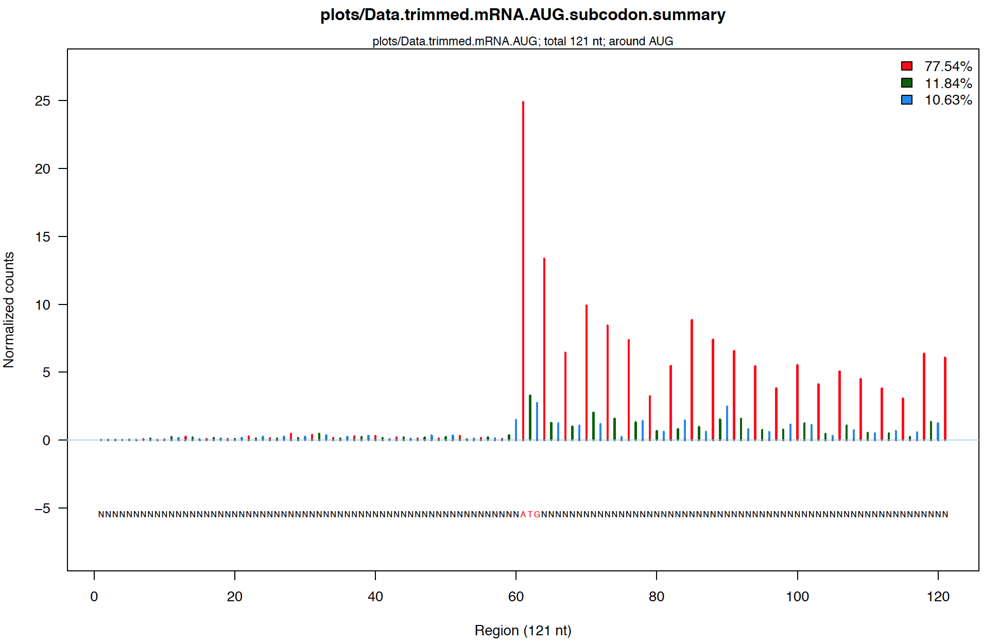

# PipeRiboseq
A comprehensive pipeline for Ribo-seq data analysis (mapping, quantification, and visualization).

PipeRiboseq has been used in the following publication:

Sun, Y.H., Zhu, J., Xie, L.H. et al. Ribosomes guide pachytene piRNA formation on long intergenic piRNA precursors. Nat Cell Biol 22, 200–212 (2020). https://doi.org/10.1038/s41556-019-0457-4

## Software prerequisites
This pipeline is designed to run on Linux servers, and requires the following software:
```
R
Python3
STAR
bowtie2
bedtools
samtools
salmon
FeatureCount (from Subread)
fastqc (optional)
cufflinks (optional)
ribotish (optional, it requires Python3)
```

The above software can also be installed using conda, as below:
```
#Create piperiboseq environment, ~15-20min
conda create --name piperiboseq
conda install -n piperiboseq -c bioconda ribotish   #Install ribotish first
conda install -n piperiboseq -c conda-forge r-base  #Will take a while to solve env
conda install -n piperiboseq -c bioconda bowtie2
conda install -n piperiboseq -c bioconda star
conda install -n piperiboseq -c bioconda bedtools
conda install -n piperiboseq -c bioconda samtools
conda install -n piperiboseq -c bioconda subread
conda install -n piperiboseq -c bioconda fastqc
conda install -n piperiboseq -c bioconda git
#We ignore cufflinks since we usually don't need it.

#Alternatively, you can create the env using the yml file provided:
conda env create --name piperiboseq --file=conda_env_Linux_piperiboseq.yml  #For Linux
conda env create --name piperiboseq --file=conda_env_MacOS_piperiboseq.yml  #For MacOS

#This environment is not compatible with salmon, so we have to download salmon and install it separately:
wget "https://github.com/COMBINE-lab/salmon/releases/download/v1.9.0/salmon-1.9.0_linux_x86_64.tar.gz"
tar -xvzf salmon-1.9.0_linux_x86_64.tar.gz
#Finally, add the salmon-1.9.0_linux_x86_64/bin directory to PATH

#Create another env for multiqc, due to the conflict with piperiboseq:
conda create --name multiqc_env
conda install -n multiqc_env -c bioconda multiqc
```

The main pipeline script is [PipeRiboseq.sh](https://github.com/sunyumail93/PipeRiboseq/blob/master/PipeRiboseq.sh), and dependencies are in the ./bin folder.

Also, for Mac OS, manually set the pipeline home directory at PipeRiboseq.sh line 58 manually,
  because the 'readlink' command does not work for MacOS:
`HomeDir="/Users/yusun/Downloads/PipelineHomeDir"`

## Pipeline setup

For mm10 (mouse) and hg38 (human), some files have been provided. If you have installed [PipeRNAseq](https://github.com/sunyumail93/PipeRNAseq) or [PipeSmRNAseq](https://github.com/sunyumail93/PipeSmRNAseq) pipeline before, then the folders such as the **bin**, **genome** folders (mm10, hg38, etc.) are compatible and many files can be shared.

Here is an example of mm10 genome setup.

1, Download scripts from GitHub to a Linux server:

```
git clone https://github.com/sunyumail93/PipeRiboseq.git
mv PipeRiboseq PipelineHomeDir

#Also, add PipelineHomeDir to PATH so PipeRiboseq.sh can be recognized:
PATH=$PATH:/path/to/PipelineHomeDir
```

2, Set up index files for genome mapping

2a, Download whole genome fasta sequence and chromosome sizes from UCSC goldenpath:

```
cd PipelineHomeDir/mm10/Sequence
wget http://hgdownload.cse.ucsc.edu/goldenPath/mm10/bigZips/mm10.fa.gz
gunzip *.gz
wget "http://hgdownload.cse.ucsc.edu/goldenPath/mm10/bigZips/mm10.chrom.sizes" -O mm10.ChromInfo.txt
```

2b, Extract RNA sequences
```
#Go to PipelineHomeDir/mm10/Annotation
cd ../Annotation
gunzip *.gz
cd ../Sequence
bedtools getfasta -s -split -name -fi mm10.fa -bed ../Annotation/mm10.RefSeq.reduced.bed12 -fo mm10.RefSeq.reduced.bed12.fa.t
cat mm10.RefSeq.reduced.bed12.fa.t|sed 's/::.*//' > mm10.RefSeq.reduced.bed12.fa
rm -rf mm10.RefSeq.reduced.bed12.fa.t
```

2c, Set up index files:
```
#Create PipelineHomeDir/mm10/Index, and go to the Index directory
cd ../
mkdir Index
cd Index

#STAR index:
mkdir STARIndex
#This will take ~1h using the 64G memory, 8 CPUs
STAR --runMode genomeGenerate --genomeDir STARIndex --genomeFastaFiles ../Sequence/mm10.fa --sjdbGTFfile ../Annotation/mm10.RefSeq.reduced.bed12.geneid.gtf --sjdbOverhang 100

#salmon index (SalmonIndex directory will be created automatically):
#Genome FASTA index fai file will also be generated
salmon index -t ../Sequence/mm10.RefSeq.reduced.bed12.fa -i SalmonIndex

#miRNA and rRNA bowtie2 index:
mkdir miRNAIndex
mkdir rRNAIndex
bowtie2-build ../Sequence/mm10.rRNA.fa ./rRNAIndex/rRNAIndex
bowtie2-build ../Sequence/mm10.miRNA.fa ./miRNAIndex/miRNAIndex
```

3, Compile the C++ program if necessary

The FastqAdapterTimmer binary file was compiled on a Linux system. It may need to be compiled again:

```
#Check if the compiled file is working or not. Go to PipelineHomeDir/bin:
cd ../bin
chmod +x FastqAdapterTimmer
./FastqAdapterTimmer

#If you encountered an error after running the above command, then compile it:
g++ FastqAdapterTimmer.cpp -o FastqAdapterTimmer
```

4, Add executable permissions for files under PipelineHomeDir/

```
#Go to PipelineHomeDir/
cd ../
#Add permission to files
chmod +x PipeRiboseq.sh
chmod +x ./bin/FastqAdapterTimmer
chmod +x ./bin/faSize
chmod +x ./bin/bedGraphToBigWig
chmod +x ./bin/bigWigToBedGraph
chmod +x ./bin/*sh
chmod +x ./bin/*py
```

Three UCSC tools (from http://hgdownload.soe.ucsc.edu/admin/exe/) are used: faSize, bedGraphToBigWig, and bigWigToBedGraph. If the binary files in the ./bin folder are not working (After `chmod +x`, then execute ./bin/bedGraphToBigWig but get errors), please re-download them by choosing the correct version (e.g. linux.x86_64). It would be better to check this manually before running the pipeline.

## Pipeline components
```
PipelineHomeDir/
    ├── PipeRiboseq.sh
    ├── bin/
    └── mm10/
      └── Annotation/
        ├── mm10.RefSeq.reduced.bed12
        ├── mm10.RefSeq.reduced.mRNA.bed12
        ├── mm10.RefSeq.reduced.bed12.geneid.gtf
        └── mm10.uniqMatching.txt
      └── Index/
        ├── miRNAIndex/
        ├── rRNAIndex/
        ├── SalmonIndex/
        └── STARIndex/
      └── Sequence/
        ├── mm10.fa
        ├── mm10.fai
        ├── mm10.ChromInfo.txt
        ├── mm10.miRNA.fa
        ├── mm10.rRNA.fa
        └── mm10.RefSeq.reduced.bed12.fa
    └── hg38/
       ...
```

Notes: 

1, For the Annotation folder, download GTF file from UCSC table browser. `reduced`: Only one location was chosen when one gene duplicates at multiple genomic loci.

2, `uniqMatching.txt` file contains one-to-one matching from transcript to gene name.

3, For the Index folder, indexes are not included in this github directory, but need to be created during set up.

4, For the Sequence folder, `RefSeq.reduced.bed12.fa` was converted from `RefSeq.reduced.bed12` file using bedtools, and removed two rRNA genes (rRNA affects salmon quantification TPM). `genome.fa` and `ChromInfo.txt` files need to be downloaded from UCSC goldenpath. The fai index file is not required now since it will be generated by samtools when needed.

## Usage

Type the pipeline name, then you will see the manual page:

```
PipeRiboseq.sh
```

Manual page:


The trimming script also has a manual page:

```
FastqAdapterTimmer
```


## Examples

A regular run using mostly default parameters:

```
PipeRiboseq.sh -i Data.fastq.gz -g mm10 -normCDS
```

More parameters used, and plot given genes in the list file (mRNAs in the list file must be Refseq mRNA ID: NM_xxx):

```
PipeRiboseq.sh -i Data.fastq.gz -g mm10 -noqc -noriboqc -p 4 -normCDS -m 3 -plotRNA list
```

## Test run

The demo fastq file is in PipelineHomeDir/Demo/Demo.trimmed.fastq.gz, which is a small fraction of the public dataset [GEO SRA: SRR989509](https://www.ncbi.nlm.nih.gov/sra/?term=SRR989509&utm_source=gquery&utm_medium=search).

Run the demo to test the pipeline. This will finish in ~10min:

```
#If using conda, activate the env first:
conda activate piperiboseq

PipeRiboseq.sh -i Demo.trimmed.fastq.gz -g mm10 -p 4 -normCDS
```

## Run a real dataset to test the pipeline

1, Download data

Use a public dataset: [GEO SRA: SRR989509](https://www.ncbi.nlm.nih.gov/sra/?term=SRR989509&utm_source=gquery&utm_medium=search)

`fastq-dump` is part of [NCBI SRA Toolkit](https://trace.ncbi.nlm.nih.gov/Traces/sra/sra.cgi?view=software):

```
fastq-dump --split-3 SRR989509
```

2, Trim adaptor using the trimming script from /bin repository: FastqAdapterTimmer

```
FastqAdapterTimmer -i SRR989509.fastq -a CTGTAG -o Data.trimmed.fastq
gzip Data.trimmed.fastq
```

3, Run Ribo-seq pipeline:

```
PipeRiboseq.sh -i Data.trimmed.fastq.gz -g mm10 -p 4 -normCDS
```

## Outputs

1, Length distribution of Ribo-seq mapped reads:


2, Ribo-seq corrected 5´-ends around top expressed mRNAs' AUG:



3, Ribo-seq corrected 5´-ends around top expressed mRNAs' STOP codon:


4, An example of individual gene visualization:


5, Ribo-seq QC by [RiboTISH](https://github.com/zhpn1024/ribotish):


